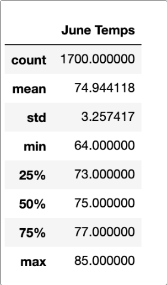
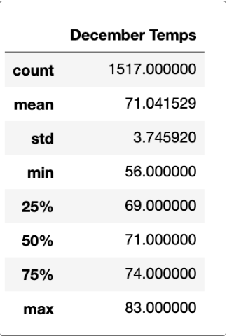

# Surfs Up

## Overview of the Analysis
In this analysis, W. Avy wants more information about temperature trends before opening the surf shop. Specifically, he wants temperature data for the months of June and December in Oahu, in order to determine if the surf and ice cream shop business is sustainable year-round. We need to pull data from these months and provide our results to W. Avy.

## Results
### Key Differences between June and December

1. Temperatures in June (on average) appear to be about 5 degrees higher. This is not that big of a difference for polar opposite times of the year. This is good news for W. Avy, providing support for creating his surf shop.
2. The spread of the data for June is 21 degrees, and the spread for December is 27 degrees. While this does show some variability, the IQR for  June is 4 degrees and the IQR for December is 5 degrees. This baccks the point that the weather really is not that variable. Constant temperatures provide further reasoning for W. Avy to open his surf shop.
3. 

## Summary

